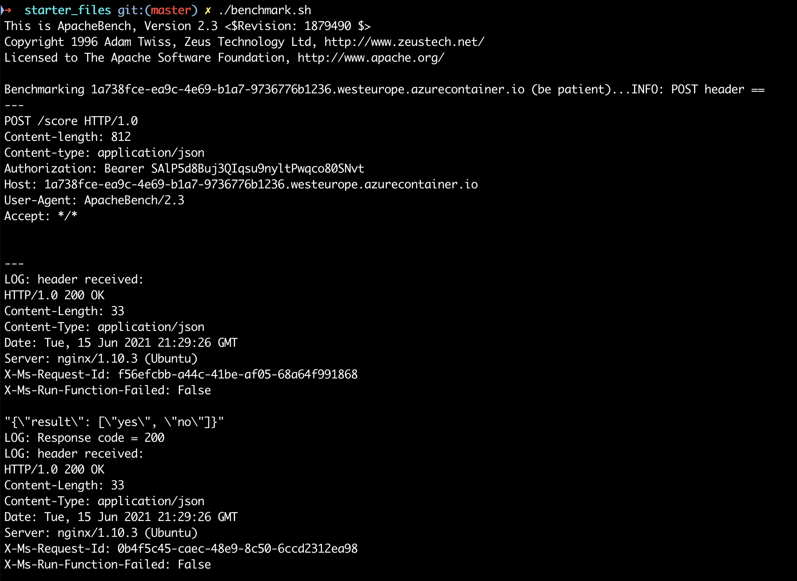

*NOTE:* This file is a template that you can use to create the README for your project. The *TODO* comments below will highlight the information you should be sure to include.

# Your Project Title Here

*TODO:* Write an overview to your project.

In this project we are demonstrating key concepts of operationalizing models and pipelines in Azure ML. For this purpose we use a classification model for bank marketing data that predicts whether or not a customer could be converted. AutoML is used to create multiple model candidates and the best performing model is deployed to be consumed as a REST endpoint. We futhermore show how the training of a model could be exposed as a REST endpoint as well using ML pipelines. 

## Architectural Diagram
*TODO*: Provide an architectual diagram of the project and give an introduction of each step. An architectural diagram is an image that helps visualize the flow of operations from start to finish. In this case, it has to be related to the completed project, with its various stages that are critical to the overall flow. For example, one stage for managing models could be "using Automated ML to determine the best model". 

## Key Steps
*TODO*: Write a short discription of the key steps. Remeber to include all the screenshots required to demonstrate key steps. 

### 1 Authentication

It is often preferable to have non-personel users accessing resources instead of personal ones. That it why we create a service principal and assigned to the RBAC role "Owner" in the scope of our Azure ML Workspace.

From the screenshots you can see how I created a SP using the CLI. Since I am using version 2 of the `az` CLI, I was not able to assigned the role in the suggested way but did it from the portal.

*Create Service Principal using az CLI*

*Assigned role "Owner" to SP*

### 2 Automated ML Experiment

To train a model, I first registered the training dataset.

*Registered training dataset*

This data was then used to train determine a good model candidate for the problem using Auto ML.

*The finished AutoML run*

*The best model from the run*

### 3 Deploy the Best Model

This best model was then deployed with authentication enabled. The compute target for the model endpoint is Azure Container Instance. In the process of deployment, the best model is also registered in Azure ML.

### 4 Enable logging

In order to be enable monitoring of the endpoint, I enabled `Application Insights`. 

*AI enabled endpoint*

On my local computer, I could run a Python script to examine the logs of the endpoint.

*Logs*

### 5 Swagger documentation

Azure ML provides a Swagger definition for the deployed endpoint. To demonstrate the usage of the Swagger definition, a web app called `SwaggerUI` is needed. I ran the `SwaggerUI` in a Docker container and pointed to a the Swagger definition via a local web server started from a Python script (`serve.py`). 

*Swagger UI showing methods of the model endpoint*

### 6 Consume Model Endpoints

I did some example requests against the model endpoint using a Python script (`endpoint.py`) on my local machine. The requests were successful. Using `Apache Benchmark` I ran some benchmarking against the endpoint. The outcome is shown in the screenshot below.

*Consuming model endpoint from python script on local machine.*

*Apache Benchmark script against model endpoint*

### 7 Create, Publish, and Consume a Pipeline

Azure ML does not only allow to automate model inference using model endpoints but has support for pipeline endpoints as well. These can be used - for example - to train (or retrain) models in automated processes like devops pipelines.

Using the provided notebook, I created a pipeline that uses  AutoML to determine a good model for the already well known classification problem. After pipeline run completed, the resulting model was tested and I deployed the pipeline. The pipeline can now be triggered using the endpoint shown in the screenshot below was published. This is what I did in the final step.

*AutoML run to get another model candidate*

*The endpoint for the published pipeline*

*The dataset and AutoML module of the pipeline*

*Details of the published pipeline*

*Pipeline run widget*

*Triggered pipeline run in ML studio*

## Screen Recording
*TODO* Provide a link to a screen recording of the project in action. Remember that the screencast should demonstrate:

## Standout Suggestions
*TODO (Optional):* This is where you can provide information about any standout suggestions that you have attempted.

I tried to implement a devops pipeline that is checking the metric of the best model from the training pipeline against the metric of the deployed model and replaces it if it is better.
